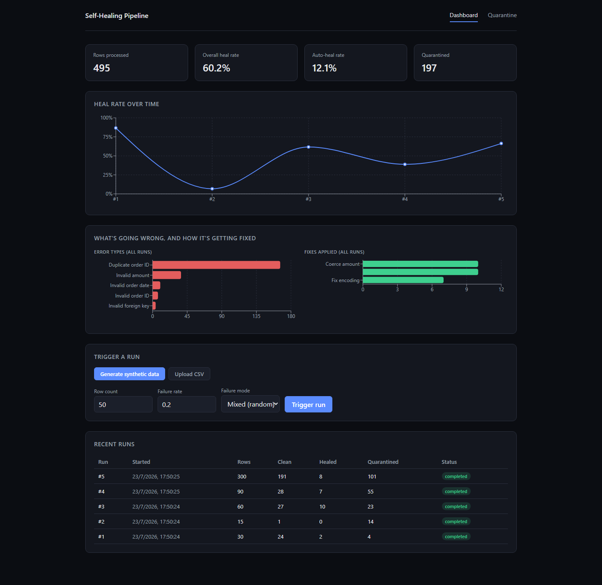
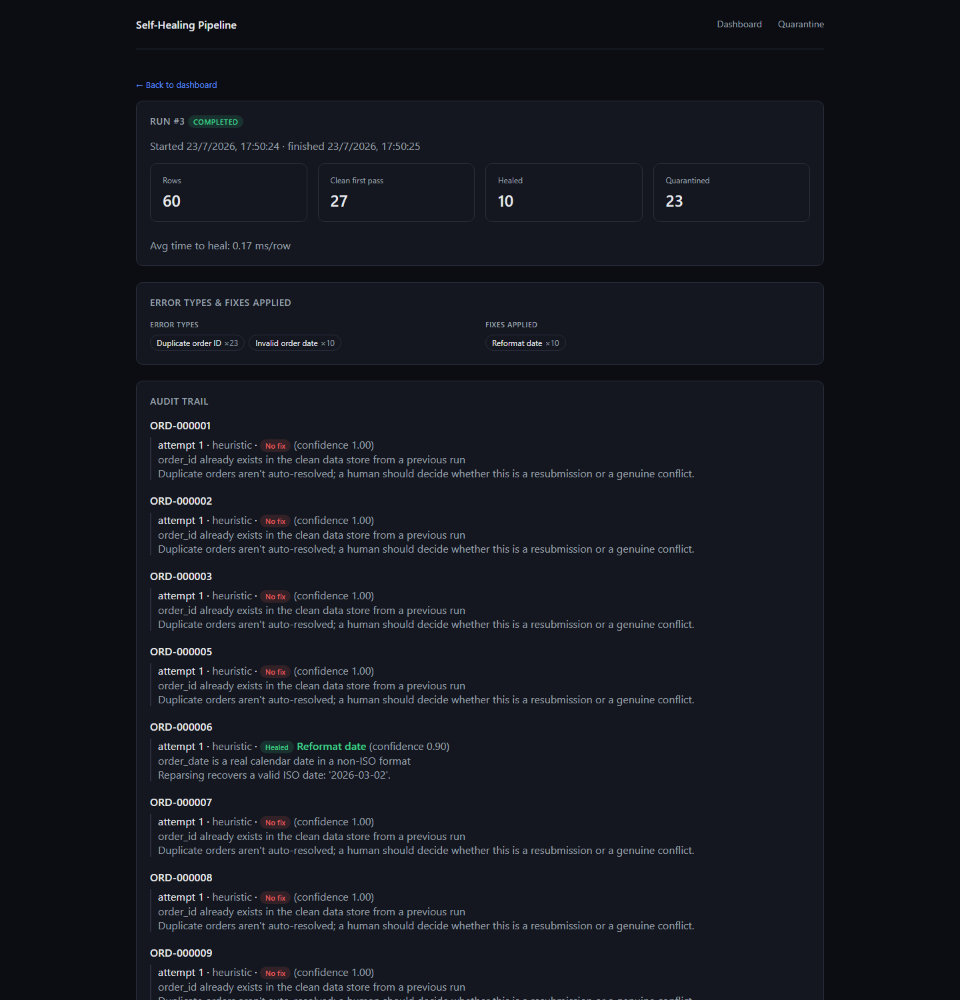
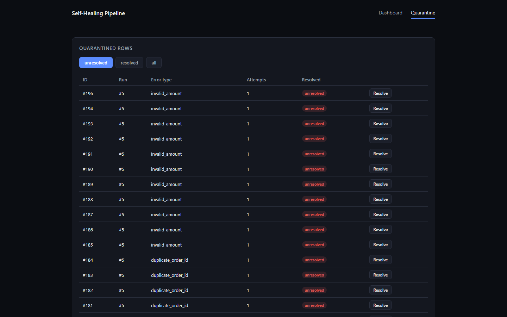

# Self-Healing Data Pipeline

[](https://github.com/Triyas27/self-healing-data-pipeline/actions/workflows/ci.yml)

**Live demo**: [self-healing-pipeline-frontend.onrender.com](https://self-healing-pipeline-frontend.onrender.com). Free-tier hosting, so the backend may take a few seconds to wake up on the first request.

A system that ingests messy real-world order data, validates it against a defined schema, and automatically diagnoses and repairs a fixed set of known failure classes before falling back to human-reviewed quarantine.

Full requirements: [Self-Healing-Pipeline-Requirements.docx](Self-Healing-Pipeline-Requirements.docx)

## Screenshots

**Dashboard**: heal rate over time, error/fix breakdown across every run, and recent run history.



**Run detail**: the full per-row audit trail for a single run, what was diagnosed, what was tried, and why.



**Quarantine**: rows that couldn't be safely auto-repaired, held for human review.



## Stack

- **Backend**: FastAPI, SQLAlchemy (SQLite by default, Postgres via config), Groq SDK
- **Frontend**: React + Vite dashboard
- **Deployment**: Docker / docker-compose locally, Render (blueprint in `render.yaml`) for a hosted instance

## How it's put together

- **Data layer**: SQLAlchemy models for orders, runs, quarantine, and audit history, plus a Pydantic schema that validates format, ranges, and enums on the way in.
- **Synthetic data generator**: produces batches of fake orders with a configurable failure rate, or a single named failure type for isolated testing.
- **Ingestion & validation**: reads a CSV (upload, path, or generated batch), normalizes it, and checks it against the schema and the known-customers list. Bad rows get isolated instead of failing the whole batch, unless the CSV itself has an unexpected column, in which case the whole thing gets rejected.
- **Diagnosis**: an LLM call (Groq) or a deterministic heuristic fallback figures out what's wrong with a row and proposes a fix from a small fixed set of transforms, or says it can't be fixed. No fabricated values, ever.
- **Repair & quarantine**: applies the fix, re-validates, and retries up to a cap. Anything that can't be healed goes to quarantine with the full history of what was tried.
- **Orchestration**: ties all of the above into one tracked run and logs stats as it goes.
- **API + dashboard**: FastAPI backend, React frontend, for triggering runs and browsing what happened.

See [docs/architecture.md](docs/architecture.md) for more detail on each piece.

## Getting Started

```bash
# backend
cd backend
cp .env.example .env
pip install -r requirements.txt
uvicorn app.main:app --reload

# frontend
cd frontend
npm install
npm run dev
```

The dashboard starts empty. To see it populated the way it looks in the screenshots above, seed a handful of varied demo runs:

```bash
cd backend
python -m scripts.seed_demo
```

It's safe to run once against a fresh database and refuses to touch anything if runs already exist. Delete `backend/data/pipeline.db` first if you want to regenerate the demo data from scratch.

### Docker

```bash
cp backend/.env.example backend/.env
docker-compose up --build
```

Backend on `:8000`, frontend on `:5173`. Seed demo data the same way as above, just run it inside the backend container instead:

```bash
docker-compose exec backend python -m scripts.seed_demo
```

## Deploy

`render.yaml` deploys both services on [Render](https://render.com)'s free tier (no credit card required): the backend as the same Docker image used locally, the frontend as a static build with its API URL baked in at build time.

1. Push this repo to GitHub, then in Render: **New > Blueprint**, pick the repo. It creates both services from `render.yaml`.
2. Once both are up, note their URLs (`https://self-healing-pipeline-backend.onrender.com` and the frontend's equivalent, unless those names were already taken).
3. On the **backend** service, set `CORS_ALLOWED_ORIGINS` to the frontend's URL.
4. On the **frontend** service, set `VITE_API_BASE_URL` to the backend's URL, then trigger a manual redeploy. Vite bakes this in at build time, so saving the env var alone doesn't apply it.
5. Optionally set `GROQ_API_KEY` on the backend for real LLM diagnosis. Without it, everything still works via the heuristic fallback.

Two things about the free tier worth knowing: the backend spins down after 15 minutes of inactivity, so the first request after a while takes a few extra seconds to wake it up, and the SQLite database resets on every restart (including that spin-down/wake-up cycle, not just a redeploy) since the free plan has no persistent disk. The backend re-seeds itself automatically on startup whenever it finds an empty database, so this is self-correcting rather than something to remember to do by hand. Set `AUTO_SEED_DEMO_DATA=false` on the backend service to turn that off.

## License

[MIT](LICENSE)
